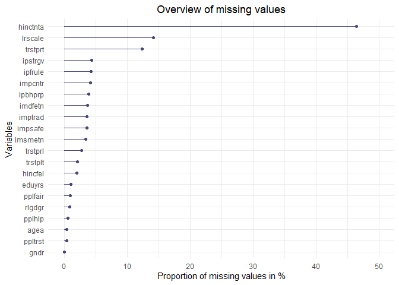
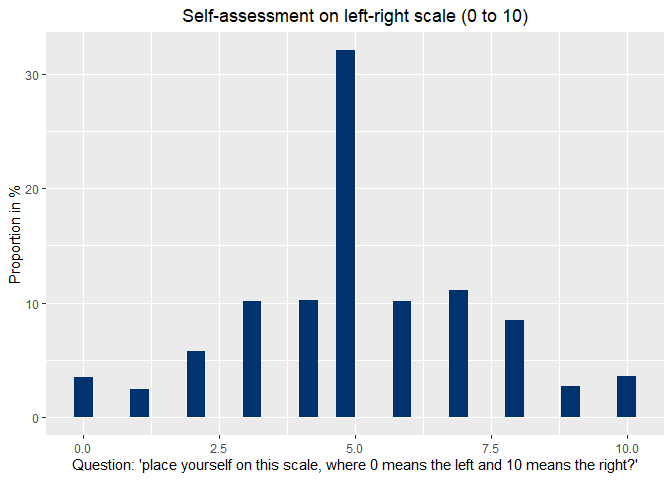
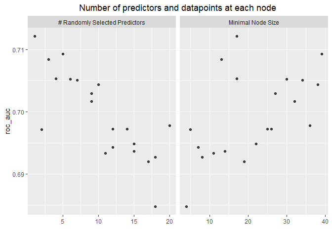
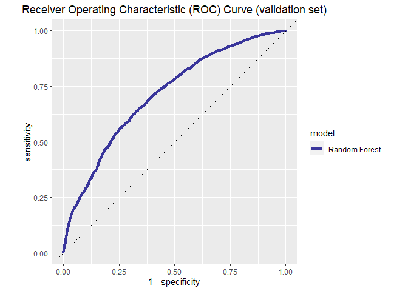
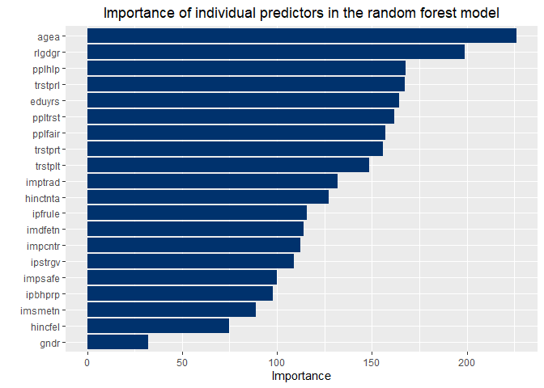
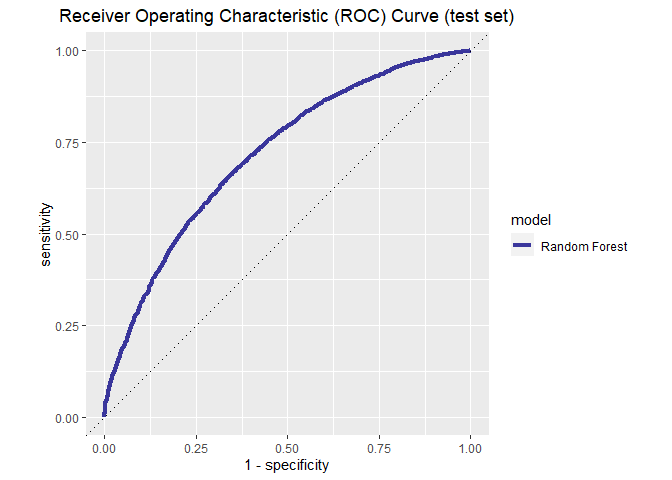

###  Model for Predicting Right-Wing Extremism - A Data Science Analysis of the European Social Survey

#### R Version 4.0.2 (22.06.2020) - RStudio Version 1.3.1056
<br>

#### Data: European Social Survey (Round 1-9)

#### Data access: <a href="https://www.europeansocialsurvey.org/downloadwizard/" class="uri">https://www.europeansocialsurvey.org/downloadwizard/</a>

#### Version: ESS1-9 edition 1.1

#### ESS1-2002, ed.6.6 (release date 01.12.2018)

#### ESS2-2004, ed.3.6 (release date 01.12.2018)

#### ESS3-2006, ed.3.7 (release date 01.12.2018)

#### ESS4-2008, ed.4.5 (release date 01.12.2018)

#### ESS5-2010, ed.3.4 (release date 01.12.2018)

#### ESS6-2012, ed.2.4 (release date 01.12.2018)

#### ESS7-2014, ed.2.2 (release date 01.12.2018)

#### ESS8-2016, ed.2.2 (release date 10.12.2020)

#### ESS9-2020, ed.3.0 (release date 10.12.2020)

<br>

#### Clear workspace

``` r
rm(list = ls())
```

#### Load packages

``` r
Packages <- c("tidyverse",   # 1.3.0      Data preparation
            "tidymodels",    # 0.1.3      Modeling, data division
            "ranger",        # 0.12.1     Random Forest Algorithm
            "vip",           # 0.3.2      Variable importance
            "parallel"       # 4.0.2      Parallel calculation
           )

lapply(Packages, require, character.only = T)
rm(Packages)
```

### Data import and preparation

#### Import of the cumulative dataset consisting of ESS round 1-9

#### 422.985 observations

``` r
Data <- haven::read_sav('ESS1-9.sav')
```

#### Create variable set

``` r
Data <- Data %>%
  dplyr::select(lrscale,
                impsafe,
                ipstrgv,
                ipbhprp,
                ipfrule,
                imptrad, 
                imsmetn,
                imdfetn,
                impcntr,
                rlgdgr,
                ppltrst,
                pplfair,
                pplhlp,
                trstprl,
                trstplt,
                trstprt,
                eduyrs,
                gndr,
                agea,
                hincfel,
                hinctnta,
                rlgdgr
               )
```

#### Dataset overview

``` r
summary(Data)
```

    ##     lrscale         impsafe         ipstrgv         ipbhprp     
    ##  Min.   : 0.00   Min.   :1.000   Min.   :1.000   Min.   :1.000  
    ##  1st Qu.: 4.00   1st Qu.:1.000   1st Qu.:1.000   1st Qu.:2.000  
    ##  Median : 5.00   Median :2.000   Median :2.000   Median :2.000  
    ##  Mean   : 5.13   Mean   :2.321   Mean   :2.309   Mean   :2.634  
    ##  3rd Qu.: 7.00   3rd Qu.:3.000   3rd Qu.:3.000   3rd Qu.:3.000  
    ##  Max.   :10.00   Max.   :6.000   Max.   :6.000   Max.   :6.000  
    ##  NA's   :60058   NA's   :15320   NA's   :18395   NA's   :16734  
    ##     ipfrule         imptrad         imsmetn         imdfetn     
    ##  Min.   :1.000   Min.   :1.000   Min.   :1.000   Min.   :1.000  
    ##  1st Qu.:2.000   1st Qu.:2.000   1st Qu.:2.000   1st Qu.:2.000  
    ##  Median :3.000   Median :2.000   Median :2.000   Median :2.000  
    ##  Mean   :3.128   Mean   :2.693   Mean   :2.171   Mean   :2.508  
    ##  3rd Qu.:4.000   3rd Qu.:4.000   3rd Qu.:3.000   3rd Qu.:3.000  
    ##  Max.   :6.000   Max.   :6.000   Max.   :4.000   Max.   :4.000  
    ##  NA's   :18049   NA's   :15537   NA's   :14685   NA's   :15722  
    ##     impcntr          rlgdgr          ppltrst          pplfair      
    ##  Min.   :1.000   Min.   : 0.000   Min.   : 0.000   Min.   : 0.000  
    ##  1st Qu.:2.000   1st Qu.: 2.000   1st Qu.: 3.000   1st Qu.: 4.000  
    ##  Median :3.000   Median : 5.000   Median : 5.000   Median : 6.000  
    ##  Mean   :2.586   Mean   : 4.678   Mean   : 5.005   Mean   : 5.586  
    ##  3rd Qu.:3.000   3rd Qu.: 7.000   3rd Qu.: 7.000   3rd Qu.: 7.000  
    ##  Max.   :4.000   Max.   :10.000   Max.   :10.000   Max.   :10.000  
    ##  NA's   :17541   NA's   :3925     NA's   :1606     NA's   :4105    
    ##      pplhlp          trstprl          trstplt          trstprt     
    ##  Min.   : 0.000   Min.   : 0.000   Min.   : 0.000   Min.   : 0.00  
    ##  1st Qu.: 3.000   1st Qu.: 2.000   1st Qu.: 2.000   1st Qu.: 1.00  
    ##  Median : 5.000   Median : 5.000   Median : 4.000   Median : 3.00  
    ##  Mean   : 4.882   Mean   : 4.378   Mean   : 3.507   Mean   : 3.46  
    ##  3rd Qu.: 7.000   3rd Qu.: 6.000   3rd Qu.: 5.000   3rd Qu.: 5.00  
    ##  Max.   :10.000   Max.   :10.000   Max.   :10.000   Max.   :10.00  
    ##  NA's   :2378     NA's   :11874    NA's   :9046     NA's   :52557  
    ##      eduyrs           gndr            agea           hincfel     
    ##  Min.   : 0.00   Min.   :1.000   Min.   : 13.00   Min.   :1.000  
    ##  1st Qu.:10.00   1st Qu.:1.000   1st Qu.: 33.00   1st Qu.:1.000  
    ##  Median :12.00   Median :2.000   Median : 48.00   Median :2.000  
    ##  Mean   :12.37   Mean   :1.538   Mean   : 48.29   Mean   :2.066  
    ##  3rd Qu.:15.00   3rd Qu.:2.000   3rd Qu.: 63.00   3rd Qu.:3.000  
    ##  Max.   :60.00   Max.   :2.000   Max.   :123.00   Max.   :4.000  
    ##  NA's   :4751    NA's   :332     NA's   :1900     NA's   :8619   
    ##     hinctnta     
    ##  Min.   : 1.0    
    ##  1st Qu.: 3.0    
    ##  Median : 5.0    
    ##  Mean   : 5.2    
    ##  3rd Qu.: 7.0    
    ##  Max.   :10.0    
    ##  NA's   :196387

#### Analysis of missing values (NA’s)

``` r
anyNA(Data)
```

    ## [1] TRUE

``` r
apply(Data, 2, function(col)sum(is.na(col))/length(col)) * 100
```

    ##     lrscale     impsafe     ipstrgv     ipbhprp     ipfrule     imptrad 
    ## 14.19861224  3.62187784  4.34885398  3.95616866  4.26705439  3.67317990 
    ##     imsmetn     imdfetn     impcntr      rlgdgr     ppltrst     pplfair 
    ##  3.47175432  3.71691668  4.14695557  0.92792889  0.37968249  0.97048359 
    ##      pplhlp     trstprl     trstplt     trstprt      eduyrs        gndr 
    ##  0.56219488  2.80719174  2.13861012 12.42526331  1.12320768  0.07848978 
    ##        agea     hincfel    hinctnta 
    ##  0.44918851  2.03766091 46.42883317

#### Visualization of missing values in percent

``` r
naniar::gg_miss_var(Data, show_pct = T) + 
  ylim(0, 50) +
  labs(title = "Overview of missing values",
       x="Variables", 
       y = "Proportion of missing values in %") +
  theme(plot.title = element_text(hjust = 0.5)) 
```



``` r
#ggsave("missing_values.png")
```

#### Remove missing values / Method: complete cases

``` r
df <- Data %>% 
  drop_na()

anyNA(df) 
```

    ## [1] FALSE

``` r
nrow(df) / nrow(Data) * 100 # Ratio of data set sizes
```

    ## [1] 42.99491

``` r
#rm(Data)
```

#### Examine the distribution of the target variable

``` r
ggplot2::ggplot(df, aes(x=lrscale, y = (..count..)/sum(..count..)* 100)) + 
  geom_histogram(fill = "#00326d") +
  labs(title = "Self-assessment on left-right scale (0 to 10)",
       x="Question: 'place yourself on this scale, where 0 means the left and 10 means the right?'", 
       y = "Proportion in %") +
  theme(plot.title = element_text(hjust = 0.5)) 
```



``` r
#ggsave("histogram_lrscale.png")
```

#### Dichotomize target variable / Remove old variable

``` r
df <- df %>%
  dplyr::mutate(right_wing = car::recode(df$lrscale,
                            "0:8 = 0; 9:10 = 1; else = NA", as.factor = T))

df <- df %>% 
  purrr::modify_at("lrscale", ~ NULL)
```

#### Define gender as a categorical variable

``` r
df$gndr <- as.factor(df$gndr)

is.factor(df$gndr)
```

    ## [1] TRUE

#### Distribution of the dichotomous target variable

``` r
df %>% 
  count(right_wing) %>% 
  mutate(prop = n/sum(n) * 100)
```

    ## # A tibble: 2 x 3
    ##   right_wing      n  prop
    ##   <fct>       <int> <dbl>
    ## 1 0          170393 93.7 
    ## 2 1           11469  6.31

#### Data division

#### Stratified random sampling based on the target variable (strat = right\_wing)

#### Problem: Target variable very unevenly distributed

``` r
set.seed(42)

# 1. Data division (75%/25%)
splits   <- initial_split(df, prop = 3/4, strata = right_wing)

df_other <- training(splits) # not testing
df_test  <- testing(splits)  # testing

# Distribution target variable in not testing set
df_other %>% 
  count(right_wing) %>% 
  mutate(prop = n/sum(n) * 100)
```

    ## # A tibble: 2 x 3
    ##   right_wing      n  prop
    ##   <fct>       <int> <dbl>
    ## 1 0          127819 93.7 
    ## 2 1            8577  6.29

``` r
# Distribution of target variable in test set
df_test  %>% 
  count(right_wing) %>% 
  mutate(prop = n/sum(n) * 100)
```

    ## # A tibble: 2 x 3
    ##   right_wing     n  prop
    ##   <fct>      <int> <dbl>
    ## 1 0          42574 93.6 
    ## 2 1           2892  6.36

#### Validation set

``` r
set.seed(42)

# 2. Data division (80%/20%)
val_set <- validation_split(df_other, 
                            strata = right_wing, 
                            prop = 0.8)
val_set
```

    ## # Validation Set Split (0.8/0.2)  using stratification 
    ## # A tibble: 1 x 2
    ##   splits                 id        
    ##   <list>                 <chr>     
    ## 1 <split [109116/27280]> validation

#### Parallel calculation through more processor cores

``` r
cores <- parallel::detectCores() - 2

cores
```

    ## [1] 6

### Modeling

#### Random Forest Modeling

``` r
rf_mod <- 
  rand_forest(mtry = tune(), min_n = tune(), trees = 64) %>% 
  set_engine("ranger", num.threads = cores) %>% 
  set_mode("classification")
```

#### Random Forest recipe (optional: Preprocessing)

``` r
rf_recipe <- recipe(right_wing ~ ., data = df_other) #%>%
   #step_downsample(right_wing, under_ratio = 1) #%>% # optional, geht schneller!
   #step_dummy(all_nominal(), -all_outcomes()) %>% # One-Hot Encoding
   #step_normalize(all_numeric()) # Normalisierung
```

#### Create workflow

``` r
rf_workflow <- 
  workflow() %>% 
  add_model(rf_mod) %>% 
  add_recipe(rf_recipe)
```

#### Training & Tuning

``` r
set.seed(42)

intervalStart <- Sys.time()

rf_res <- 
  rf_workflow %>% 
  tune_grid(val_set,
            grid = 20,
            control = control_grid(save_pred = T),
            metrics = metric_set(roc_auc))
```

    ## i Creating pre-processing data to finalize unknown parameter: mtry

``` r
intervalEnd <- Sys.time()

# time measurement
paste("Duration:",intervalEnd - intervalStart, attr(intervalEnd - intervalStart,"units"))
```

    ## [1] "Duration: 3.10163471698761 mins"

#### Ranking of Random Forest Models

``` r
rf_res %>% 
  show_best(metric = "roc_auc")
```

    ## # A tibble: 5 x 8
    ##    mtry min_n .metric .estimator  mean     n std_err .config              
    ##   <int> <int> <chr>   <chr>      <dbl> <int>   <dbl> <chr>                
    ## 1     1    17 roc_auc binary     0.712     1      NA Preprocessor1_Model18
    ## 2     5    39 roc_auc binary     0.709     1      NA Preprocessor1_Model12
    ## 3     3    13 roc_auc binary     0.708     1      NA Preprocessor1_Model11
    ## 4     4    17 roc_auc binary     0.705     1      NA Preprocessor1_Model03
    ## 5     6    30 roc_auc binary     0.705     1      NA Preprocessor1_Model01

#### Visualization of Random Forest Models

``` r
autoplot(rf_res) + 
  labs(title = "Number of predictors and datapoints at each node") +
  theme(plot.title = element_text(hjust = 0.5))
```



``` r
#ggsave("predictors_nodesize.png")
```

#### Select best model based on “roc\_auc”

``` r
rf_best <- 
  rf_res %>% 
  select_best(metric = "roc_auc")

rf_best
```

    ## # A tibble: 1 x 3
    ##    mtry min_n .config              
    ##   <int> <int> <chr>                
    ## 1     1    17 Preprocessor1_Model18

``` r
rf_res %>% 
  collect_predictions()
```

    ## # A tibble: 545,600 x 8
    ##    id         .pred_0 .pred_1  .row  mtry min_n right_wing .config              
    ##    <chr>        <dbl>   <dbl> <int> <int> <int> <fct>      <chr>                
    ##  1 validation   0.975 0.0253      1     6    30 0          Preprocessor1_Model01
    ##  2 validation   0.981 0.0188      3     6    30 0          Preprocessor1_Model01
    ##  3 validation   0.967 0.0334      5     6    30 0          Preprocessor1_Model01
    ##  4 validation   0.979 0.0205      8     6    30 0          Preprocessor1_Model01
    ##  5 validation   0.982 0.0178     13     6    30 0          Preprocessor1_Model01
    ##  6 validation   0.945 0.0554     23     6    30 0          Preprocessor1_Model01
    ##  7 validation   0.993 0.00737    24     6    30 0          Preprocessor1_Model01
    ##  8 validation   0.986 0.0140     29     6    30 0          Preprocessor1_Model01
    ##  9 validation   0.956 0.0439     30     6    30 0          Preprocessor1_Model01
    ## 10 validation   0.992 0.00824    31     6    30 0          Preprocessor1_Model01
    ## # ... with 545,590 more rows

#### Define Receiver Operating Characteristic (Validation Set)

``` r
rf_auc <- 
  rf_res %>% 
  collect_predictions(parameters = rf_best) %>% 
  roc_curve(right_wing, .pred_0) %>% 
  mutate(model = "Random Forest")
```

#### Visualization of the Receiver Operating Characteristic curve (validation set)

``` r
rf_auc %>% 
  ggplot(aes(x = 1 - specificity, y = sensitivity, col = model)) + 
  geom_path(lwd = 1.5, alpha = 0.8) +
  geom_abline(lty = 3) + 
  coord_equal() + 
  scale_color_viridis_d(option = "plasma", end = .6) +
  labs(title = "Receiver Operating Characteristic (ROC) Curve (validation set)") +
  theme(plot.title = element_text(hjust = 0.5))
```



``` r
#ggsave("roc_curve_validation.png")
```

#### Final model specification

``` r
last_rf_mod <- 
  rand_forest(mtry = 1, min_n = 17, trees = 64) %>% 
  set_engine("ranger", num.threads = cores, importance = "impurity") %>% 
  set_mode("classification")

# the last workflow
last_rf_workflow <- 
  rf_workflow %>% 
  update_model(last_rf_mod)

# the last fit
set.seed(42)

intervalStart <- Sys.time()

last_rf_fit <- 
  last_rf_workflow %>% 
  last_fit(splits)

intervalEnd <- Sys.time()

# time measurement
paste("Duration:",intervalEnd - intervalStart, attr(intervalEnd - intervalStart,"units"))
```

    ## [1] "Duration: 4.44302177429199 secs"

### Results (application to new data)

#### Results based on the test set

``` r
last_rf_fit %>% 
  collect_metrics()
```

    ## # A tibble: 2 x 4
    ##   .metric  .estimator .estimate .config             
    ##   <chr>    <chr>          <dbl> <chr>               
    ## 1 accuracy binary         0.936 Preprocessor1_Model1
    ## 2 roc_auc  binary         0.718 Preprocessor1_Model1

#### Variable importance

``` r
last_rf_fit %>% 
  pluck(".workflow", 1) %>%   
  pull_workflow_fit() %>% 
  vip(num_features = 20, aesthetics = list(fill = "#00326d")) +
  labs(title = "Importance of individual predictors in the random forest model") +
  theme(plot.title = element_text(hjust = 0.5))
```



``` r
#ggsave("variable_importance.png")
```

#### Define Receiver Operating Characteristic (test set)

``` r
last_rf_auc <- 
  last_rf_fit %>% 
  collect_predictions(parameters = rf_best) %>% 
  roc_curve(right_wing, .pred_0) %>% 
  mutate(model = "Random Forest")
```

#### Visualization of the Receiver Operating Characteristic curve (test set)

``` r
last_rf_auc %>% 
  ggplot(aes(x = 1 - specificity, y = sensitivity, col = model)) + 
  geom_path(lwd = 1.5, alpha = 0.8) +
  geom_abline(lty = 3) + 
  coord_equal() + 
  scale_color_viridis_d(option = "plasma", end = .6) +
  labs(title = "Receiver Operating Characteristic (ROC) Curve (test set)") +
  theme(plot.title = element_text(hjust = 0.5))
```



``` r
#ggsave("roc_curve_test.png")
```
